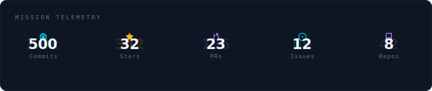

  

 

  

 

  

 

  

 

<strong>More about me</strong>

 

Sou desenvolvedor apaixonado por tecnologia, com foco em **Backend** e construção de **APIs e sistemas escaláveis**.

🎯 Buscando minha primeira oportunidade como **Desenvolvedor Júnior** (Presencial ou Híbrido).

 

  
  

<!-- Profile SVGs auto-generated -->
